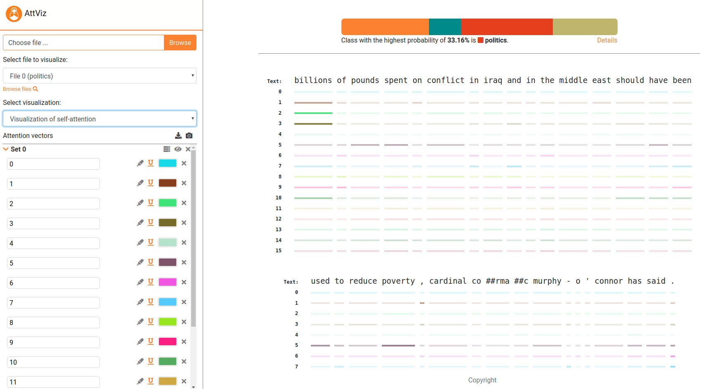

#   _AttViz_ - Self attention made *simple*

Neural language models are the state-of-the-art for most language-related tasks. One of the ways to explore their behavior, however, is via _visualization_. We present AttViz, a simple webserver suitable for *exploration* of instance-level attention, online.
The server is live at [AttViz](http://attviz.ijs.si).

Current preprint:
```
@inproceedings{skrlj-etal-2021-exploring,
    title = "Exploring Neural Language Models via Analysis of Local and Global Self-Attention Spaces",
    author = "{\v{S}}krlj, Bla{\v{z}}  and
      Sheehan, Shane  and
      Er{\v{z}}en, Nika  and
      Robnik-{\v{S}}ikonja, Marko  and
      Luz, Saturnino  and
      Pollak, Senja",
    booktitle = "Proceedings of the EACL Hackashop on News Media Content Analysis and Automated Report Generation",
    month = apr,
    year = "2021",
    address = "Online",
    publisher = "Association for Computational Linguistics",
    url = "https://www.aclweb.org/anthology/2021.hackashop-1.11",
    pages = "76--83",
    abstract = "Large pretrained language models using the transformer neural network architecture are becoming a dominant methodology for many natural language processing tasks, such as question answering, text classification, word sense disambiguation, text completion and machine translation. Commonly comprising hundreds of millions of parameters, these models offer state-of-the-art performance, but at the expense of interpretability. The attention mechanism is the main component of transformer networks. We present AttViz, a method for exploration of self-attention in transformer networks, which can help in explanation and debugging of the trained models by showing associations between text tokens in an input sequence. We show that existing deep learning pipelines can be explored with AttViz, which offers novel visualizations of the attention heads and their aggregations. We implemented the proposed methods in an online toolkit and an offline library. Using examples from news analysis, we demonstrate how AttViz can be used to inspect and potentially better understand what a model has learned.",
}
```


# Requirements
To follow the example below, please install the requirements from requirements.txt, by doing e.g.,
```
pip install -r requirements.txt
```

AttViz is fully compatible with [pytorch_transformers](https://github.com/huggingface/transformers) library!
# How to prepare inputs?
AttViz accepts attention space, encoded in the form of JSON objects, that can be constructed by using the provided scripts. An end-to-end example, which first trains a BERT-based model on a multiclass classification task, and next uses it to obtain attention data
is given next.

```python

## first build a model, then generate server input.
from generate_server_input import *
from build_bert_classifier import *

##  STEP 1: A vanilla BERT-base model.
train_seq, dev_seq, train_tar, dev_tar = read_dataset("data","hatespeech") ## hatespeech or bbc are in the repo!

bert_model = get_bert_base(train_seq, dev_seq, train_tar, dev_tar, weights_dir = "transformer_weights", cuda = False) ## for cuda, you might need the apex library

##  STEP 2: Predict, attend to and generate final json.
weights = "transformer_weights" ## Any HuggingFace model dump can be used!
test_data = "data/hatespeech/test.tsv"
delimiter = "\t"
text_field = "text_a"
label_field = "label"
number_of_attention_heads = 12
label_names = ["no","some","very","disturbing"] #['business','entertainment','politics','sport']
segment_delimiter = "|||"

## Obtain the attention information and create the output object.
## Subsample = True takes each 10th sample, useful for prototyping.

model = BertForSequenceClassification.from_pretrained(weights,
                                                          num_labels = len(label_names),
                                                          output_hidden_states=True,
                                                          output_attentions=True)

tokenizer = BertTokenizer.from_pretrained("bert-base-uncased")
out_obj = get_json_from_weights(model,
                                tokenizer,
                                test_data = test_data,
                                delimiter = delimiter,
                                text_field = text_field,
                                label_field = label_field,
                                number_of_attention_heads = number_of_attention_heads,
                                label_names = label_names,
                                segment_delimiter = segment_delimiter,
                                subsample = True)

## Output the extracted information to AttViz-suitable json.
with open('generated_json_inputs/example_hatespeech_explanations.json', 'w') as fp:
    json.dump(out_obj, fp)
    
## That's it! Simply upload this json to the attvis.ijs.si and explore!

```

The server also comes with some pre-loaded examples (generated_json_inputs), check these also (upload to server and explore).

# How to host locally?
If, due to privacy concerns, one wishes to host AttViz locally, follow the instructions next.
Install Node.js. Then,
```
npm install express
```

Next, it is as simple as:
```
node embViz.js
```

Go to the browser and type "localhost:3310". Change the ports at will.

# Disclaimer

The tool is under active development, changes are at least to some extent expected. Use at own risk.

# Contributing
Please, open a pull request, an issue or write to us if you have some interesting use cases of this methodology!

# About
The code was developed with equal contributions from Nika Eržen And Blaž Škrlj
